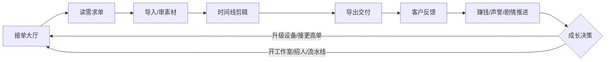

# 《剪单人生》（暂定名）游戏设计文档

> 版本：v0.3（设计迭代中）  
> 日期：2026-08-05  
> 状态：概念设计，待评审  
> 一句话概念：玩家扮演外包剪辑师，在荒诞的甲方需求与不该存在于素材里的东西之间讨生活，从接单小工一路经营到工作室老板。

---

## 1. 产品定位

### 1.1 一句话描述

一款以"非线编软件工作台"为操作界面的模拟经营 + 叙事游戏：接单、看需求、剪素材、交付，赚钱升级，同时发现客户素材里那些"本不该存在"的东西。

### 1.2 核心体验

1. **当乙方**：读懂（或故意曲解）甲方需求，用剪辑手艺交付，看客户反馈。
2. **剪刀自由**：同一个项目可以有正经剪、鬼畜剪、摆烂剪、恐怖剪，客户反应完全不同。
3. **看客视角**：素材里藏着异常，玩家能看见、能标记、能选择剪不剪进去，但无法改变素材世界本身——玩家只是看客。
4. **从小工到老板**：攒钱、招人、分派环节、上流水线，经营压力与自由度同时上升。

### 1.3 类型标签

模拟经营 · 叙事解谜 · 轻心理恐怖 · 恶搞喜剧

### 1.4 目标平台

- 最终目标：**原生多平台**——桌面（Windows/macOS，Steam 发行）+ 移动端（iOS/Android）
- 验证路径：先做 H5 demo 验证玩法与手感（浏览器即可试玩），成立后再决定原生承载方式
- 原生承载两种候选：Web 内核套壳（Tauri/Capacitor，一套代码多端）或 Godot 4 重写表现层（详见技术方案）
- 剧情与内容适合一次性购买或付费解锁，不做强制内购

### 1.5 目标玩家

- 模拟经营玩家（《Game Dev Story》《双点医院》类）
- 剪辑/自媒体从业者与爱好者（对"甲方"梗有共鸣）
- 恐怖氛围爱好者（但恐怖是调味，不是吓人游戏）

---

## 2. 设计支柱（Design Pillars）

所有系统取舍都对照这四条：

1. **甲方即地狱**：需求文本是本作最大的喜剧来源，荒诞但"逻辑自洽"。
2. **剪刀是自由的**：不做"唯一正解"，评分是"符合度 + 质量 + 客户偏好"的加权，邪道剪法也有结果。
3. **素材里住着别的东西**：异常素材是调味料和主线钩子，观察本身不惩罚玩家。
4. **小工到老板**：经营系统是成长曲线，也是叙事分层的载体（老板的视角离素材更远，信息靠员工转述）。

---

## 3. 核心循环



单次订单循环约 5–15 分钟，节奏设计目标：

- 前 2 分钟：接单 + 看需求（笑点密集）
- 中 5–10 分钟：剪辑（心流）
- 后 2 分钟：交付 + 反馈（结算爽感 / 惊吓点 / 剧情钩子）

---

## 4. 剪辑系统（核心玩法）

### 4.1 关键设计决策：模拟剪辑，不做真视频处理

游戏**不需要**真实视频编解码。所有"素材"是带元数据的媒体对象：

- 短视频循环（预生成的 mp4/webm）
- 静态图 / 序列帧
- 音频片段
- 文字/字幕对象
- 特效贴纸、转场、调色预设（参数对象）

"成片" = 时间线上素材的**播放列表 + 参数组合**。导出动画只是播放一遍 + 显示进度条。这样 H5 完全可行，性能可控（详见技术方案文档）。

### 4.2 核心思路：把操作精度换成选择节奏

剪辑不做逐帧精修，做"**选择 + 吸附 + 反馈**"：

- 玩家决定"剪在哪、留什么、怎么组合"，系统负责手感和爽感
- 每个工具都遵循同一套"节奏点"语言：好点 / 坏点 / 异常点（见 4.4）
- 评分主体是需求符合度，节奏点只影响爽感和少量质量分——避免编辑变成纯 QTE

### 4.3 首版工具集（8 件）

| 工具 | 玩法 | 好点示例 | 坏点示例 |
| --- | --- | --- | --- |
| 剪切/拼接 | 下刀、排序、拼接素材 | 动作结束、笑到最高点、鼓点 | 眨眼、说到一半、尬住 |
| 构图（位置+缩放） | 移动/放大画面，吸附构图线 | 居中、三分线、面部特写 | 切掉半张脸、人物贴边 |
| 调色 | 预设滤镜 + 参数 | 客户偏好色（喜庆红/高级灰/冷调） | 情绪相反的颜色 |
| 转场 | 硬切/淡入淡出/故障/鬼畜抖动 | 节奏点上顺滑切换 | 在怪地方"咔嚓"一下 |
| 变速 | 慢放/快进 | 慢放尴尬瞬间、快进无聊段 | 慢放放错地方（更尴尬） |
| 倒放 | 一键倒放 | 鬼畜对称、恐怖留白 | 倒放暴露不该有的东西 |
| BGM/静音 | 曲库 + 静音开关 | 情绪匹配（燃/丧/喜庆） | 静音剪掉了客户的成名曲 |
| 字幕/花字 | 文字 + 样式 + 位置 | 关键词放大、错别字梗 | 字幕遮住人脸 |

**明确不做**：多轨复杂合成、关键帧动画、逐帧精修、音频混音——范围杀手，与"做轻"目标冲突。

### 4.4 节奏点与吸附反馈（统一设计语言）

每个素材内置标记点，所有工具共用一套反馈语言：

- **好点**：天然该下刀/构图的节奏位置（动作结束、笑点、鼓点、表情峰值）
- **坏点**：事故位置（眨眼、说到一半、虚焦、丑照瞬间）
- **异常点**：素材里不该存在的东西，极少数

玩家操作靠近节奏点时触发**磁性吸附 + 特效反馈**：

| 点 | 反馈 |
| --- | --- |
| 好点 | 柔光 + 叮一声 + 小粒子；吸得正中给 "Perfect Cut" 大字 + 更强反馈 |
| 坏点 | 画面抖动 + 刺耳噪音 + 暗角闪一下 |
| 异常点 | **永不吸附、永不提示**——系统假装没这回事；玩家偶然停上去，只听到一声不对味的音效或看到一帧不该有的画面 |

关键规则：

- **好/坏是相对的**：正经单的坏点（眨眼、尬住）正是鬼畜单和喜剧单要的好点，需求系统决定某个点对当前客户是加分还是扣分
- 玩家随时可以不吸附、随手一扔（摆烂剪法），自由感不丢

### 4.5 需求与评分

需求单结构：

- 客户档案（头像、性格、历史评价）
- 需求描述（文案，喜剧核心）
- 硬性要求清单（时长范围、分辨率、必含元素、禁忌元素）
- 软性要求（风格倾向、BGM 情绪、字幕有无）
- 预算 / 截止时间 / 平台抽成
- 隐藏要求（客户没明说但评分会看，可被文本暗示）

订单生成语法：**需求 = 工具子集 + 约束 + 风格**。每个订单指定用到的工具与约束（"必须转场""慢放那三秒""剪掉所有眨眼""要喜庆色"），工具列表直接决定内容组合空间。

评分维度：

```
最终满意度 = 硬性符合度 × 0.55 + 客户偏好 × 0.25 + 剪辑质量(节奏点精度/连贯) × 0.2
```

- 节奏点精度只影响"质量"这 20%——保证剪辑有爽感但不当家
- 满意度档位 → 好评 / 中评 / 差评 / 拒付 / 追加修改 / 特殊反应
- 恶搞剪法命中"客户雷点"会触发特殊反馈（愤怒、崩溃、笑疯、沉默不语）
- 声誉影响接单池：高声誉解锁高价单与神秘单

---

## 5. 素材异常与"看客"机制

### 5.1 异常类型表（设计弹药库）

| 类别 | 示例 |
| --- | --- |
| 画面异常 | 背景多出一个不该在的人、人物镜像、空荡场景里的影子移动、画面角落的奇怪涂鸦 |
| 时间异常 | 素材标注 10 秒实际播放 11 秒、第 24 帧夹了一帧不认识的画面、倒放后出现正常对话 |
| 音频异常 | 倒放后出现低语、BGM 里混进心跳、客户原声带里有人在叫主角名字 |
| 文件异常 | 文件名是给玩家的留言、素材重复但内容不同、缺失的素材在导出时"自己回来了" |
| 元数据异常 | 拍摄时间在未来的素材、客户名字和素材水印对不上 |

### 5.2 玩家可做的选择（不惩罚观察）

1. **无视**：当没看见，正常交付。
2. **标记**：在素材上加"异常标记"（观察行为，纯记录，推进玩家自己的线索本）。
3. **剪进成片**：把异常内容做成成片一部分（可引客户特殊反应、推进主线、也可能只是被当成鬼畜梗）。
4. **报告客户**：通过聊天向客户指出异常（触发客户对话，可能收获情报或差评）。

核心原则：**素材世界不可改变，玩家只能选择看或不看**。观察不扣钱、不掉理智，观察本身就是玩法与叙事回报——这正是"看客"主题的机制化。

### 5.3 异常系统的结构

- 异常信息存在素材元数据层，播放时由预览层叠加渲染（如第 24 帧的闪现画面）
- 异常点在编辑器里**永不吸附、永不提示**（见 4.4），玩家只能靠自己发现
- 玩家有自己的"线索本"（观察记录），主线推进依赖观察而非强制
- 异常强度随章节缓慢升级：先荒诞搞笑，后心理恐怖，最后揭开源头

### 5.4 出现节奏（调味原则）

异常是"打开礼物时偶尔摸到一张纸条"，不是步步惊心：

- 普通单：平均 **5–6 单**才出现一次异常，前期以搞笑向为主
- 中后期：密度升到 **3–4 单一次**，但撞过一次后**保证连续 1–2 单是干净的**（喘息期）
- 神秘单：每单必有异常（接单前明示"素材有点怪"）
- 单局内不连续触发异常，避免节奏过紧
- **恐怖浓度开关**：玩家可关闭暗线，关闭后异常单全部替换为普通高价单

---

## 6. 客户与订单系统

### 6.1 常驻客户档案（示例，10 位左右）

| 客户 | 人设 | 典型需求 | 剪辑雷点 |
| --- | --- | --- | --- |
| 秃头老板 | 微商团队长 | "把我在台上剪得年轻 20 岁，素材用我 2010 年的" | 剪出真实发量 |
| 大学生小琳 | 期末作业 | "纪录片风格，但我素材是宿舍自拍" | 太正经反而扣分 |
| 恐怖片学生 | 毕业作品 | "帮我剪出'旁边有人的感觉'，但我没拍那个人" | 把"那个人"剪没了 |
| 婚礼哥 | 婚庆跟拍 | "把我前女友背影剪进去 0.5 秒，别让老婆发现" | 任何可疑帧 |
| 美食博主 | 探店 UP 主 | "吃播剪得诱人点，我把吃吐的部分也发你了" | 保留完整呕吐 |
| 纪录片导演 | 老派甲方 | "一镜到底，不许用转场，预算三千" | 加了转场 |
| 神秘客户 | ??? | 需求越来越怪，素材来源不明 | 正常剪反而触发剧情 |
| 警察叔叔 | 线索整理 | "把监控里 3 点 15 分的人找出来" | 漏掉"不存在的人" |
| 偶像运营 | 粉丝向 | "让爱豆看起来眼里有光" | 光没加到人身上 |
| 公司 HR | 年会视频 | "突出团队精神，把裁员名单剪掉" | 名单出现在最后一帧 |

### 6.2 订单池机制

- 同时挂 3–5 个可接订单，按声誉/进度解锁
- 每个订单有难度、预算、风险（差评概率、异常含量）
- 拒单不惩罚，但错过"限时特殊单"会有剧情影响
- 客户会**追加修改单**（重开存档项目，二剪），是"回看系统"的天然入口

---

## 7. 工作室经营系统

### 7.1 成长阶段

| 阶段 | 状态 | 玩法变化 |
| --- | --- | --- |
| 1 接单小工 | 出租屋 + 旧电脑 | 只能手动剪，设备影响可用功能（无调色/无转场） |
| 2 攒钱升级 | 换设备/买插件 | 解锁功能与风格库，接单效率上升 |
| 3 开工作室 | 租工位、招人 | 可把项目环节分派给员工 |
| 4 流水线 | 模板化、批量单 | 收入爆炸但作品同质化，触发剧情分支 |
| 5 品牌阶段 | 有口碑、挑单做 | 自由接单 vs 赚钱效率的终极权衡 |

### 7.2 员工系统

员工类型：剪辑助理 / 字幕员 / 配音员 / 调色师 / 审片员 / 跑腿兼运营

员工属性：

- 技能（各环节熟练度，影响产出质量）
- 速度（交稿耗时）
- 摸鱼度（概率搞砸或拖延）
- 怪癖（如"拒绝剪恐怖镜头"、"每单必加猫叫音效"）
- 忠诚度（高薪/剧情事件影响）

关键设计：**员工会发现素材异常**。老板（玩家）离素材越来越远，只能看员工提交的"异常报告"截图和文字描述——视角拉开后，恐怖感由"亲眼所见"变成"转述"，这是叙事设计而非功能缺失。

### 7.3 经营压力

- 房租、工资、设备折旧、平台抽成
- 差评公关（花钱删差评 or 硬扛）
- 客户跑单（做完不付钱，可追讨或吃哑巴亏）
- 员工被挖角、员工私下接单

---

## 8. 剧情与叙事

### 8.1 主线框架（暂定）

主角因故从大厂后期岗位离职，靠"剪客网"接单维生。接单越多，素材里的异常越频繁，且异常有共同源头——一部从未完成的电影《观众》。神秘客户不断地下"怪单"，诱导主角把异常剪进成片。最终揭示：主角的每一次"看见"，都在让《观众》里的某个东西更完整；而主角自己的出租屋监控录像，可能也在某个陌生剪辑师的时间线上。

### 8.2 结局分支（3–4 个）

1. **剪刀手结局**：坚持只做正经生意，异常全剪掉——安全但空虚，某个客户永远消失。
2. **看客结局**：只看不剪，集齐所有观察记录，成为《观众》唯一的"观众"。
3. **导演结局**：主动把异常剪进成片，成为《观众》的合作者，主角也变成素材。
4. **关机结局**（隐藏）：在关键节点选择"不接单"，把游戏关掉（叙事性打破第四面墙）。

### 8.3 叙事载体

- 聊天窗口（客户、神秘人、员工群）
- 需求文本（最大喜剧来源）
- 素材内容本身（最有效恐怖来源）
- 客户回访与邮件
- 工作室留言板 / 账本 / 线索本

---

## 9. 项目档案与回看系统

- 每个订单保存**完整时间线 JSON + 成片播放数据 + 评分与客户反馈**
- 档案页：项目列表、时间、收入、满意度、当时的异常标记
- 回顾模式：重看成片（按播放列表重放）、查看当时的选择
- 复剪入口：客户追加修改单、或玩家主动"重剪"旧项目做导演剪辑版
- 隐藏收集要素：每个项目的"未发现异常"数量，全发现有成就

---

## 10. UI/UX 设计（参考 DaVinci Resolve）

### 10.1 页面结构（对应 Resolve 的页面概念）

| 游戏页面 | 对应 Resolve | 功能 |
| --- | --- | --- |
| 接单大厅 | Media（媒体）页 | 订单列表、素材预览、接单入口 |
| 工作台 | Edit（剪辑）页 | 核心编辑：四区布局 |
| 调色台 | Color（调色）页 | 滤镜/调色参数（简化版） |
| 交付台 | Deliver（交付）页 | 导出设置、导出动画、上传等待 |

### 10.2 工作台四区布局（核心界面）

```text
┌─────────────────────────────────────────────────────────────┐
│ 顶部工具条：选择 | 刀片 | 构图 | 调色 | 转场 | 变速 | 倒放 | 音频 | 字幕 │
├──────────────┬───────────────────────┬──────────────────────┤
│ 素材库       │  预览窗口              │  检查器 Inspector      │
│ (Media Pool) │  播放/暂停/逐帧        │  素材属性/变换/调色    │
│ 缩略图列表   │  当前需求清单浮层      │  音频/文字参数         │
│              │                       │                      │
├──────────────┴───────────────────────┴──────────────────────┤
│ 时间线 Timeline：V1 / V2 / A1 / 字幕轨，播放头 + 标尺          │
│ 左下：项目名   │  右下：导出按钮                               │
└─────────────────────────────────────────────────────────────┘
```

### 10.3 简化原则

- 不做 Resolve 全功能，只做 8 个核心工具（见 4.3），每个工具一眼懂
- 所有工具共用"节奏点吸附"一套手感，学会一个就会全部
- 需求清单做成可固定在预览窗口旁的小浮层，随剪辑实时勾选完成度
- 游戏信息（钱、声誉、截止时间）放在编辑器外层的 HUD，不污染编辑区
- 触屏适配：拖拽、长按、双指缩放时间线

---

## 11. 内容量估算（成本大头是文案）

| 内容 | 数量 | 说明 |
| --- | --- | --- |
| 订单库 | 40–60 单 | 含一次性单与重复单变体 |
| 常驻客户 | 10 位 | 每位有个人小剧情线 |
| 异常素材 | 30+ 个复用件 | 与订单随机组合，避免"背版" |
| 主线章节 | 8–12 章 | 以订单为章节载体 |
| 需求文案 | 5 万字级 | 喜剧核心，质量优先 |
| 素材资产 | 200+ 段短视频/图/音频 | 可程序化生成（见技术方案） |

---

## 12. 风险与对策

| 风险 | 对策 |
| --- | --- |
| 时间线 UI 复杂度失控 | MVP 锁死工具数量，命令模式 + 撤销重做先行 |
| 内容量大、产能不足 | 素材程序化生成、订单模板化、异常件复用组合 |
| 恐怖元素过审问题 | 恐怖浓度可调：平台版弱化、PC 完整版；恐怖以"氛围"为主而非血腥 |
| 模拟经营与剪辑玩法割裂 | 经营系统只做"分派环节"，不引入复杂生产链 |
| 移动端手感差 | 桌面优先，触屏为适配层；小屏可开启"简化模式" |
| 玩家疲劳 | 单局节奏压缩、异常/喜剧交替出现、回看系统提供收集驱动力 |

---

## 13. 待定问题（下一步需要拍板）

1. 美术风格：像素风 / 低多边形 / 扁平插画？（影响素材制作成本）
2. 是否需要中文配音（客户语音），还是纯文字？
3. 移动端是否随首发（桌面优先已定，移动端适配排期待定）
4. 正式名字候选：《剪单人生》《外包剪辑师》《剪刀乙方》《Cut for You》

---

> 配套文档：[技术方案与引擎选型](./02-技术方案与引擎选型.md) · [开发路线图](./03-开发路线图.md)
